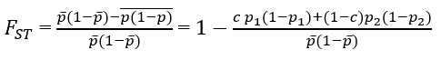
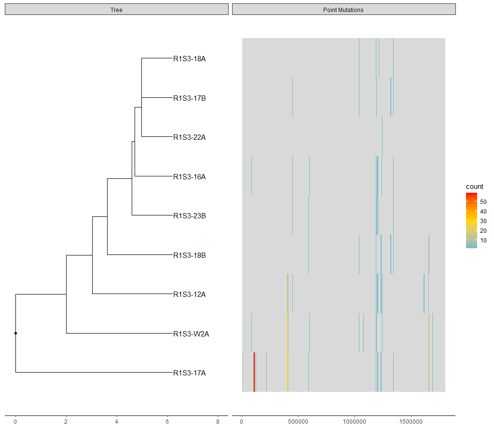

# SNP-compR

## Introduction
SNP-compR (SNP-compare) is an R package made for bacterial comparative genomics. It offers functionality to:
1. Compare mutations among highly similar genomes.
2. Characterize each identified mutation by type (indel, SNP etc.).
3. Identifies the outcome of each mutation (non-synonymous, synonymous, frameshift etc.), as well as the post-mutation translation product.
4. Generate visualizations of mutations.

In order to obtain such results, the following files should be provided as input:
i. **A multi-VCF file** of a set of highly similar genomes (Can be derived from multiple VCF files, see **Input Generation**), generated using the same reference genome.
ii. **An annotated reference genome**, provided in long `GFF3` format (annotation + `FASTA`).

## Installation
Install `SNP-compR` via `devtools`:
```
devtools::install_github("davidtong28/SNP-compR")
```
SNP-compR requires the following R packages:
1. dplyr
2. tidyr
3. magrittr
4. stringr
5. vcfR
6. ape
7. Biostrings
8. ggplot2
9. ggtree
They will be installed automatically if not already installed

## Input Generation
In order to compare a set of highly similar bacterial genomes, first select an appropriate reference genome. This could be either a publicly available whole genome that is close enough to your genomes, or your own fragmented genome. However, if you choose to use a fragmented genome, it is highly recommended to re-align the fragmented genome to a whole genome before any variant calling is done.
After selecting a reference genome, the next step is to perform variant calling. This can be achieved by many tools such as [FreeBayes](https://github.com/freebayes/freebayes). The goal is to generate a set of VCF files.
Using [Samtools](https://github.com/samtools/samtools), compress and index all VCF files:
```
for file in *.vcf; do bgzip $file; done; for file in *.vcf.gz; do tabix -p vcf $file; done
```
Using [BCFtools](https://samtools.github.io/bcftools/bcftools.html), merge all VCF files into a multi-VCF file
```
bcftools merge -m all *.vcf.gz > merged.vcf;bcftools norm -f /path/to/reference/fasta -m - merged.vcf > norm_merged.vcf
```
The `norm_merged.vcf` file contains a multi-VCF file with all mutation sites normalized (multiple mutations at the same site are counted in different lines), and is the desired input for this tool. `/path/to/reference/fasta` is the path to the fasta file of your reference genome.
A separate annotated reference genome (in either long `GFF3` format, containing both annotation and FASTA data, or a short `GFF3` format file with a FASTA file) must be provided as input.

## Running SNP-compR
You can either run `SNP-compR` as a do-it-all script, or manually call its functions however you wish.
### Do-it-all script
Under construction...
### Calling separate functions
#### Input data
The input data will be 
```
input_data_long(vcf_path,long_gff_path,dna_path=NA,vcf_name="vcf",gff_name="gff",concat_dna_name="dna",dna_name=paste(concat_dna_name,"_contigs",sep = ""))
```
- The VCF data will be stored at variable "vcf_name" in global environment (which is `vcf` by default).
- The annotation will be stored into the variable "gff_name" (which `gff` by default) and FASTA into "concat_dna_name" (concatenated DNA, `dna` by default) and "dna_name" (DNA in contigs, `dna_contigs` by default).
- When `dna_path` is NA (default), a long `GFF3` file will be expected. Alternatively, you can specify `dna_path` to input a short `GFF3` file and a `FASTA` file, in which case, the provided GFF3 will be interpreted as a short GFF3 file, and the FASTA components will be ignored.
#### SNP analysis
```
vcgff_gen(vcf=vcf,gff=gff,dna_c=dna,dnaContigs=dna_contigs,virulence=F,count=F,remove_consensus=F,fix_contig_name=NA)
```
The main function. Takes in VCF and GFF data, and outputs a dataframe that records all CDS-altering mutations, identifies their outcomes (non-synonymous, synonymous, frameshift etc.), and predicts the post-mutation translation product. Intergenic mutations will be ignored. Here are the descriptions of its input arguments:
- `vcf` vcfR object, ideally generated from FreeBayes. Defaults to global environment object 'vcf'.
- `gff` Reference sequence annotation GFF3 feature table. Ideally generated by Bakta. Defaults to global environment object 'gff'.
- `dna_c` Reference concatenated DNA sequence, DNAString object. Defaults to global environment object 'dna'.
- `dnaContigs` Reference fragmented DNA sequence, DNAString object. Defaults to global environment object 'dna_contigs'.
- `virulence` *BETA*. Defaults to FALSE. If TRUE, marks all virulence genes, which is indicated by the description of the translation product in the gff file.
- `remove_consensus` if a mutation should be removed had all the genomes contained that same mutation. Defaults to FALSE and only works when count is TRUE.
- `count` if the presence absence of the loci should be counted, defaults to FALSE.
- `fix_contig_name` *BETA*. Defaults to NA. If the contig names on the GFF file and the VCF file does not match, you can provide a vector of fixed contig names, which matches the names on the gff file. Contig names on the VCF and the dnaContigs will be changed accordingly.
```
fst_<-function(mut_table,subpop_vector)
```
When given a suspected subpopulation, `fst_` is able to calculate the [FST](https://en.wikipedia.org/wiki/Fixation_index) of all mutation loci from an output sheet of the main function `vcgff_gen()`. FST is calculated using the following equation:  

- `mut_table` Output sheet from the main function `vcgff_gen()`.
- `subpop_vector` A vector that records the suspected subpopulation that would be examined for FST. The vector should be numerical, in the order of the column name that appeared in the mut_table.
#### SNP visualization
```
draw_SNP_phylo(mut_table,half=F,range=c(0,2000000),win=(range[2]-range[1])/200,
                         GGTR=as.phylo(htree(mut_table)) %>% ggtree(ladderize = F)+geom_tiplab(align = T)+geom_rootpoint()+ xlim_tree(5.5), Size=7)
```
This is a visualization function to draw SNP distributions by position in the form of sliding windows.
- `mut_table` Output sheet from the main function `vcgff_gen()`.
- `half` If mutations that exactly half of the genomes have should be inverted, defaults to FALSE
- `range` The range of the DNA region to be plotted, defaults to c(0,2000000)
- `win` size of the sliding window, defaults to range_length/200
- `GGTR` A ggtree object of the genomes wished to be drawn. A tree will be automatically drawn from `mut_table`, if no tree is given.
- `Size` Text size, defaults to 7

## Expected results
- The expected results for the main function, `vcgff_gen` should be a large dataframe that stores all identified non-intergenic mutations. Each row is an identified mutation. Columns 1-28 records the properties of the mutations, such as start and end positions, expected outcome and product etc. Columns 29+ records the presence and absence of these mutations in all isolates. One example of the output dataframe can be seen [here](https://cloud.cidgoh.ca/s/LSpNTQPZCd83mC3).  
- The expected results for `fst_` should be an altered version of the aforementioned dataframe, with FST and other data added.  
- The expected results for `draw_SNP_phylo` should look like this:  



